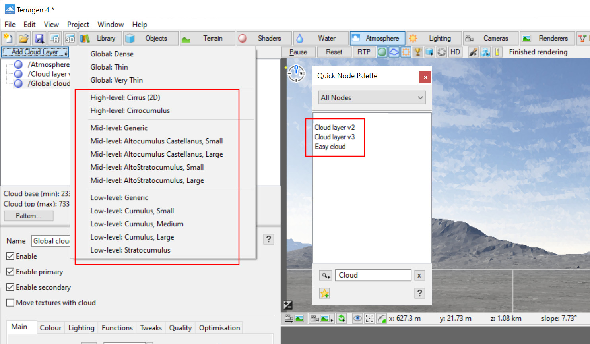
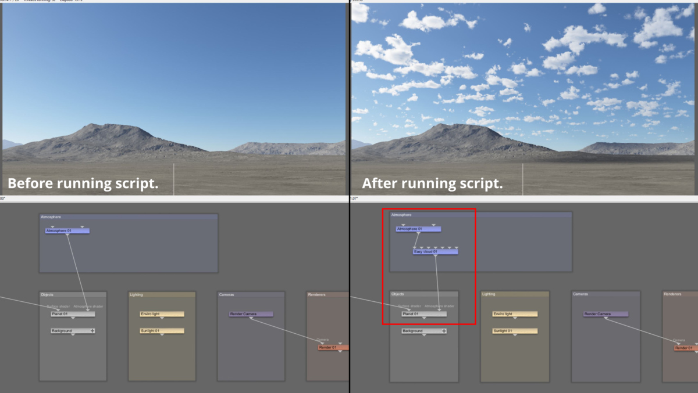
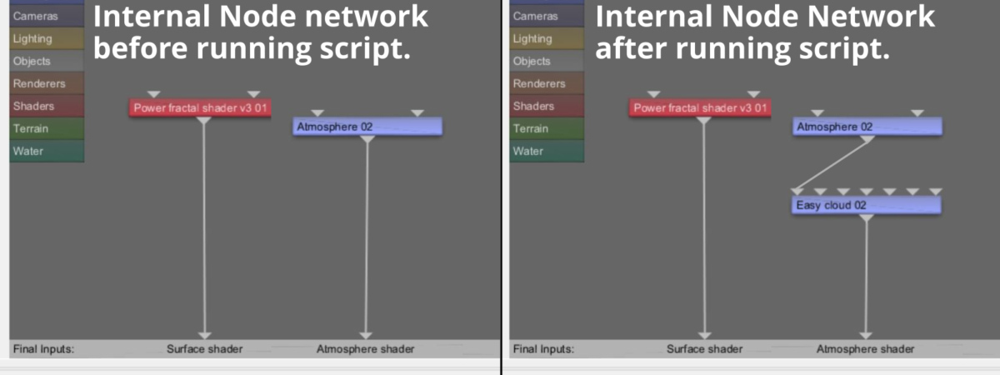

# tg-add-random-cloud

A fully functional Python script implementing Terragen 4 Professional’s remote procedure call (RPC) feature to add a random cloud layer to the active Terragen project. 

Have you ever wanted to quickly add some clouds to a project, while not really caring about the type of cloud layer it is?  Perhaps you just need a cloud layer to test with, or are looking for some arbitrary inspiration?  This script randomly adds a cloud layer to the project based on one of the cloud presets located in the Terragen GUI or the Quick Node Palette.

### Requirements:

Terragen 4 Professional v4.6.31 (or later)  
https://planetside.co.uk/  

terragen-rpc  
https://github.com/planetside-software/terragen-rpc  

### Installation:

Make sure you’ve installed Terragen 4 Professional v4.6.31 or greater on your computer, and installed the terragen_rpc module, via the pip install command.  

This script has no interface.  The images folder contains an icon file, should you wish to create a shortcut on your desktop for the script and assign the icon to the shortcut.  Clicking on the shortcut icon will run the script.  

### Usage:

Running the script will add a cloud layer to the active Terragen project.   The cloud layer is assigned to the first planet found in the project; if no planets exist in the project, the cloud layer is simply added to the root level of the project.  

If the node assigned to the planet’s atmosphere shader resides within the planet’s internal node network, the cloud layers are also created within the internal node network; otherwise they will be created at the root level of the project.  

    

  

### Known issues:

When a node is added to the Terragen project via RPC, it is positioned in the center of the Node Network pane.  This can lead to nodes stacking up on top of each other in the Node Network pane, or not being “contained” within groups of similar type nodes, i.e. other cloud layers in the Atmosphere group.  
 
### Reference: 

terragen-rpc  
https://github.com/planetside-software/terragen-rpc  

Online documentation for Terragen RPC  
https://planetside.co.uk/docs/terragen-rpc/  

Blog posts on using Terragen RPC  
https://planetside.co.uk/blog/hello-rpc-part-1-scripting-for-terragen/  
https://planetside.co.uk/blog/hello-rpc-part-2-error-handling/  
https://planetside.co.uk/blog/script-it-yourself-kelvin-sunlight-colour-with-terragen-rpc/  

